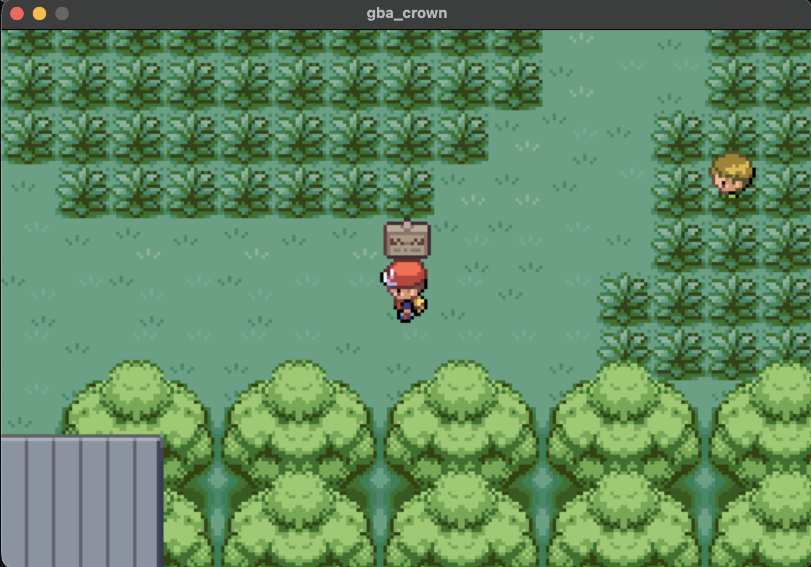

# Crown GBA

A Game Boy Advance emulator written in [Crown](https://github.com/MashDevel/crown-lang). The emulator core, save handling, command line, and native frontends are implemented in Crown. Windows uses Win32, GDI, system audio, and XInput; macOS uses AppKit, Metal, and AVFAudio; Linux uses X11, PipeWire, and joystick input through the host's system libraries. Windows, macOS, and glibc Linux support x86-64 and ARM64.



`src/frontend/playback` runs frames, maps controls, and coordinates playback. `src/platform` contains the Windows, macOS, Linux, and Bedrock system bindings used by that frontend.

The included `roms/circuit-breaker.gba` is an original game, Circuit Breaker. No commercial game ROM or GBA BIOS is included. Bring your own legally obtained games and BIOS files.

## Set up

On Windows, download and extract the matching [Crown x86-64 or ARM64 archive](https://github.com/MashDevel/crown-lang#start), keep the bundled source directories beside `crown.exe`, and add that directory to your user PATH. Open PowerShell, then use the `crown` commands below. Ordinary builds require no C compiler, SDK, or third-party library installation.

On macOS/Linux, install the current Crown binary release using the [Crown installer](https://github.com/MashDevel/crown-lang#start):

```sh
curl -fsSL https://raw.githubusercontent.com/MashDevel/crown-lang/main/install.sh | sh
```

Open a new terminal, or run the PATH command printed by the installer, then:

```sh
crown --version
git clone https://github.com/MashDevel/crown-gba.git gba
cd gba
```

This revision requires Crown’s [Windows subsystem support](https://github.com/MashDevel/crown-lang/commit/7b2bb31786ff1c0fd6c3e5fc96c06617d9df02c7), including when building on macOS or Linux. If your binary release predates that change, use it to build the current compiler checkout first. In Windows PowerShell, from a directory alongside `gba`:

```powershell
git clone https://github.com/MashDevel/crown-lang.git lang
$env:CROWN_ROOT = (Resolve-Path lang).Path
crown build lang/components/compiler -o lang/crown.exe
$env:PATH = "$env:CROWN_ROOT;$env:PATH"
```

On macOS/Linux, the equivalent is:

```sh
git clone https://github.com/MashDevel/crown-lang.git lang
export CROWN_ROOT="$PWD/lang"
crown build lang/components/compiler -o lang/crown
export PATH="$CROWN_ROOT:$PATH"
```

Crown and GBA can live in separate locations. GBA declares `source = "src"` and selects the bundled `platform` and `integrations` libraries by name. The standard library is automatic. Its test runner selects the bundled `toolchain` library. No manifest refers to Crown's internal source directories.

Then, in `gba`, build and play Circuit Breaker:

```sh
crown run . -- roms/circuit-breaker.gba
```

Pass a cartridge path to play another game:

```sh
crown run . -- path/to/game.gba
```

`crown run` builds the project before launching it. The compiler supplies the standard library from its selected installation. The executable is written to `target/debug/gba_crown` (`target/debug/gba_crown.exe` on Windows).

The desktop frontends present a 240×160 framebuffer in a 720×480 window with nearest-neighbor scaling. The keyboard controls are arrows for the directional pad, Z for A, X for B, Backspace for Select, Return for Start, A for L, S for R, and Escape to quit. Save-backed cartridges write a `.sav` file beside the ROM when the window closes normally.

## BIOS and headless use

An optional BIOS path may follow the ROM. With a BIOS, execution starts at the ARM reset vector; without one, the emulator uses direct boot and its HLE BIOS implementation. The HLE implementation does not cover every BIOS call, and game compatibility is incomplete.

```sh
crown run . -- path/to/game.gba --headless 60
crown run . -- path/to/game.gba --steps 1000000
crown run . -- path/to/game.gba --headless 60 --screenshot frame.bmp
crown run . -- path/to/game.gba path/to/gba_bios.bin --headless 60
```

Only one execution mode may be selected. `--screenshot` writes the last frame as a 240×160, 24-bit BMP. The older `screenshot frame.bmp` form is also accepted.

## Test

```sh
crown test . --filter headless
```

The project test suite builds the emulator, runs CPU and frame fixtures, checks screenshots, Unicode save paths, and command-line failures, and verifies the macOS clock binding. Windows also creates a native window, checks framebuffer colors and keyboard events, exercises audio queueing, loads XInput, and verifies normal window close. On a logged-in macOS desktop, run `crown test .` to include the native Metal drawable memory check. Crown's `check .` type-checks the emulator; `test .` executes its project tests. For manual playback QA, play Circuit Breaker for at least 30 seconds and check movement, sprites, sound, and normal window close. Repeat with another cartridge and confirm save persistence if it uses backup memory.

The ROM in `roms/` matches the build from the separate, original `projects/circuit-breaker` workspace project (SHA-256 `d27c606729141ca009bcfb51e37acc061775163c6c248342ee1acf3d582b0f57`). The small ROMs in `tests/fixtures` are generated from the adjacent assembly fixtures.

## Quality checks

The [Test workflow](.github/workflows/test.yml) runs on every push, pull request, manual dispatch, and weekly schedule. It checks x86-64 and ARM64 Windows, Linux, and macOS using the Crown revision pinned in the workflow. It checks formatting, types, structural limits, duplication, functional tests, and coverage. The workflow keeps running independent checks after a failure and uploads reports and test diagnostics for each host.

`Crown.toml` sets the same structural and formatting limits as Crown: 300 code lines per file, 60 per function, cyclomatic complexity 10, cognitive complexity 15, nesting depth 4, and 5 parameters. Duplication must stay at or below 3%. Both line and branch coverage must reach 95% in every reported source package; a workspace average cannot satisfy the gate.

Run the checks from `gba`:

```sh
mkdir -p target/quality
crown fmt src tests --check
crown lint . --output target/quality/app.json
crown lint tests --output target/quality/suite.json
crown lint tests/core --output target/quality/core.json
crown lint tests/validation --output target/quality/validation.json
crown duplication /path/to/workspace --output target/quality/duplication.json
crown test . --filter headless --coverage target/quality/coverage
crown coverage target/quality/coverage --output target/quality/coverage.json
```

On Windows, also run `crown lint tests/windows --output target/quality/windows.json` for the native API tests.

Lint each project separately because the app and test executables have different entry points and source sets. The duplication command must receive the root of your full workspace so it scans source and tests as one corpus. The CI workspace contains both GBA and its Crown toolchain checkout.

CI uses the documented headless suite because hosted runners have no interactive desktop. On a logged-in macOS desktop, omit `--filter headless` to include the native Metal drawable check. For release QA, run all quality commands, inspect every host's reports, and perform the playback and save-persistence checks above. A failed lint or coverage command must remain a failed check.

The initial release has existing structural and coverage failures. The macOS baseline has three files over the line limit and four functions over the cognitive complexity limit. Its full functional suite passes 24 checks, while GBA coverage is 82.19% of lines and 69.09% of branches. Those initial measurements compiled libraries as application sources; the current dependency model measures each project's owned sources. Formatting passes and GBA's source-and-test duplication is 1.01%, which is a project measurement rather than the required workspace result. These figures describe the initial baseline; CI reports contain the current measurements. Thresholds are enforced without waivers, so the quality workflow remains failing until the outstanding gaps are fixed.

## Windows

On Windows x86-64 or ARM64, `crown run . -- roms/circuit-breaker.gba` opens a resizable window with nearest-neighbor scaling and a centered image. Keyboard controls match macOS/Linux. XInput controllers map A/B, Back/Start, the D-pad or left stick, and shoulder buttons to the GBA controls. Input is released when the window loses focus. Escape and the window close button exit normally and save cartridge backup memory.

The Windows executable uses the GUI subsystem, so launching it does not create a console window. Frames are retained and drawn through an off-screen bitmap before a single window copy; resize and restore events repaint the retained frame.

Audio uses the Windows waveform output API with buffered 48 kHz stereo samples. Emulation and audio run on a worker independently of window messages. After an underrun, playback refills its queue before restarting. If no output device is available, playback continues silently at the same rate. ROM, BIOS, screenshot, and save paths support Unicode. Save replacement uses a flushed, exclusively created temporary file beside the destination.

For Windows playback QA, play Circuit Breaker for at least 30 seconds on each architecture. Launch the built executable directly and confirm no console appears. Check image colors, continuous resizing, dragging the title bar for several seconds, and minimizing/restoring; sound should continue during window interaction and the picture should not flash black. Check keyboard and controller input, focus changes, and sound. Test without an audio output device. Close with Escape and the close button; reopen a save-backed cartridge and confirm persistence. Repeat from a directory containing spaces and non-ASCII characters. CI verifies native API execution, but audible output and physical controller behavior still need these manual checks.

## Linux and Steam Deck

On a supported x86-64 glibc Linux host with X11 and PipeWire, `crown run` uses the Linux frontend. The Steam Deck also reads its controller and left stick. Linux audio is resampled to 48 kHz and the frontend may skip video frames to recover from audio starvation.

To cross-compile Linux assembly on macOS and link it on the Deck:

```sh
crown compile target/gba-linux.s . --target x86_64-linux
```

Transfer the assembly to the Deck, then run:

```sh
as --fatal-warnings -o gba.o gba-linux.s
ld --fatal-warnings -o gba_crown /usr/lib/crt1.o /usr/lib/crti.o gba.o -lc -lm /usr/lib/crtn.o --dynamic-linker /lib64/ld-linux-x86-64.so.2
./gba_crown path/to/game.gba
```

The cross-link command assumes the listed glibc startup files and loader exist at those paths. Verify image, sound, controls, and save loading and writing on the target machine.

## License

MIT; see [LICENSE](LICENSE). The bundled Circuit Breaker ROM and test fixtures are included under the same license. Crown itself is a separate dependency with its own MIT license.
